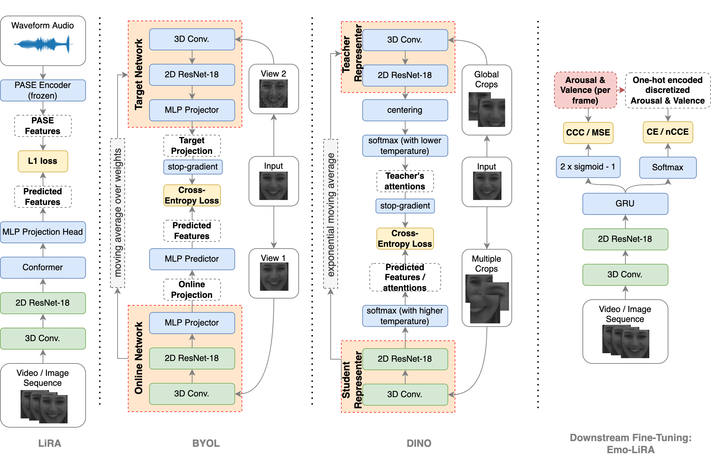

# VAERR_SelfSupervisedVE
## Self-Supervised Apparent Emotion Recognition from Video
[[Page]](https://research.facebook.com/publications/ss-vaerr-self-supervised-apparent-emotional-reaction-recognition-from-video/) [[arXiv]](https://arxiv.org/abs/2210.11341)

This code is provided to accompany the homonymous paper and is meant to serve the reproduceability of the results.
The metiod is based on the self-supervised learning paradigm, where the _pretext_ architecture is trained on an auxiliary often unrelated task in order to provide good initialization or learn useful representations for the _downstream_ target task.

We are interested specifically in natural apparent emotional reaction recognition (in terms of arousal and valence) based on the video-only input, or VAERR. 

## Architecture
The part of the architecture pretrained and shared between the pretext and the downstream tasks is the 3D convolutional layer + ResNet18, as shown on the picture below. Followed by a GRU.



<!--  -->


## Results
This is the first work using the self-supervised setting in this context, presenting the state-of-the-art results for the natural apparent emotional reaction recognition.


## Setting up the environment
To reproduce the results please first create and activate a conda environment with the corresponding dependencies:
```
conda create --name myenv python=3.8.10 --file requirements_minimal.txt
conda activate myenv
```
OR
```
conda create --name myenv python=3.8.10
conda activate myenv
pip install numpy==1.20.2 scipy==1.1.0 torch==1.8.1+cu111 torchvision==0.9.1+cu111  opencv-python==4.5.2.54 pillow==8.2.0 pykeops==1.5 sklearn==0.0 -f https://download.pytorch.org/whl/torch_stable.html
```

## Training
Pretext pretraining is very similar to the original pretext models presented in the paper, with some minor adjustments to the architecture conducted for comparability sake. The codes and papers can be found here:
- LiRA [paper](https://arxiv.org/abs/2106.09171) and [code](https://github.com/Instassa/Lipreading_ICASSP21_Release) (private repository, would need to request an access from the author);
- BYOL [paper](https://papers.nips.cc/paper/2020/file/f3ada80d5c4ee70142b17b8192b2958e-Paper.pdf) and [code](https://github.com/lucidrains/byol-pytorch);
- DINO [paper](https://arxiv.org/abs/2104.14294) and [code](https://github.com/facebookresearch/dino).

This repository contains to the downstream portion of the model. 
Please specify the the checkpoint you would like to use as ` --model-path='./ckpts/ckpt_3Dconv.pth' `

To launch the downstream training and subsequent evaluation please run:
```
python -W ignore main.py --lr 0.0003 --epochs 3 --batch-size 5 --workers 20 --clip_length 4 \
      --model-path='./ckpts/ckpt_3Dconv.pth' --dataset='sewa_video' --allow-size-mismatch --loss-type 6 --fine-tuning FT \
      --video-path='/fsx/marijajegorova/pre-process/step2_affine_transformation/sewa13crop_videos_npz_preprocessed_full/‘ \
      --annot-path='/fsx/marijajegorova/pre-process/step2_affine_transformation/SEWA_annot_binned20/'
```
### Specifying the parameters of iterest.
- All the normal things, such as `--epochs`, `--batch-size`, and `--lr`, are available.
- Pretext checpoint is being passed through the model path and is `--allow-size-mismatch` is required to for allowing to share weights between non-identical architectures, just the layers that match in shape and size.
- Sampling segments of training videos is vonducted through `--clip_length` (in seconds) and `--segments_per_file`.
- The downstream training can also be controled via `--fine-tuning` variable, specifying what part of the shared weights is frozen (if any), and  `--loss-type`, defined as follows:
    *  1 is Mean Square Error
    *  2 is Concordance Coefficient (CCC)
    *  3 is Cross-Entropy (CE) for discretized labels
    *  4 is Binary Cross-Entropy - might be useful depending on how the discretization is set up
    *  5 is a linear combinaton of CCC and CE
    *  6 is a linear combination of CCC, CE, and MSE
    *  7 is a linear combinaton of CCC and CE for arousal, but only CCC for valence (in order to compensate for poor arousal detection from video modality)
    *  8 is a linear combinaton of CCC, CE, and MSE for arousal, but only CCC for valence
    *  9 is a linear combination of CCC and a normalized cost-sensitive cross-entropy harvested from continuous labels discretized into 20 bins
    *  10 is a linear combination of 9 and additional MSE loss.

- Finally, video and annotation paths should be provided. Videos should be preprocessed via RetinaFace detector and Face Alignment Network (FAN) to detect 68 landmarks, and crop a dquare frame containing all of these landmarks. _(I will try to find a reference / push the exact pre-processing to GitHub at some point)._

## Evaluation

_Currently `main().py` runs evaluation of the model straight after the training is over._


### For any questions that might arise please contact [Dr. Marija Jegorova](mailto:marijajegorova@fb.com?subject=[GitHub]%20Question%20about%20VAERR)
### If you are using this code in any way please kindly cite _add BibTex here_
